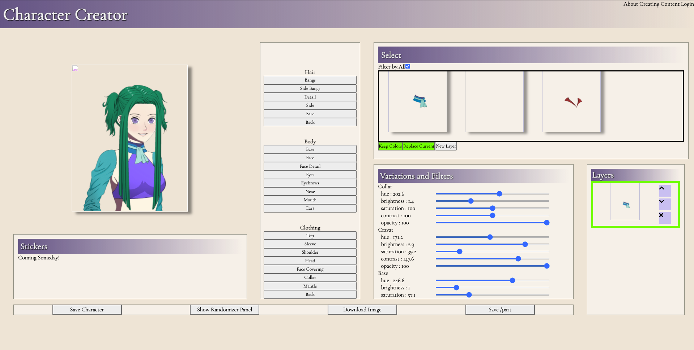
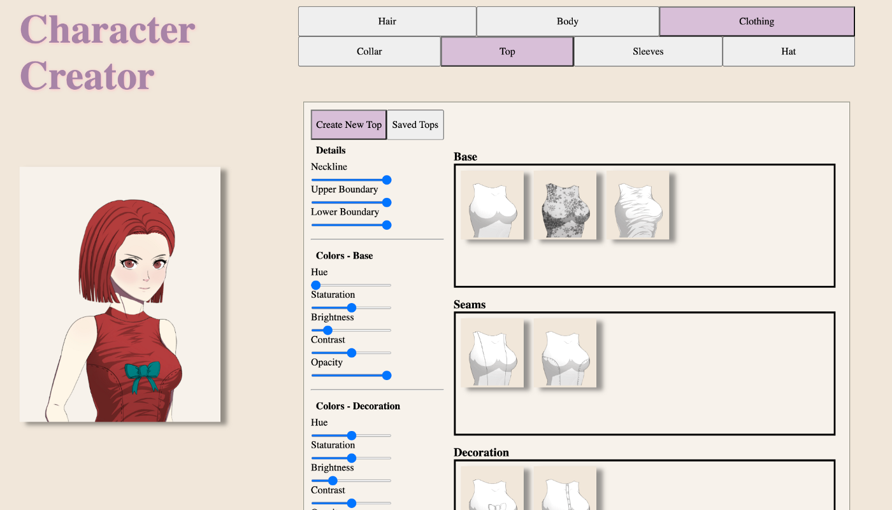

# Character Creator 2.0
## Introduction
This is the second iteration of my Character Creator browser game. The user can compose a character portrait by selecting different pieces of clothing and hair styles. The character portrait is displayed by layering either PNGs or SVGs using the CSS grid property. I discontinued the first Character Creator because the way I was mangaging assets was slowing the app down and the way I was creating the assets themselves was extremly time comsuming.

Character Creator 2.0 uses CSS clip-paths to erase portions of the underlying images. This work was previous done in the raster image editing program Inkscape.

This application of clip-paths requires complex and precise sets of coordinates. I created my own clip path editer to reduce the amount of time I spent drawing the paths.

Checkout the editer here: https://floating-dusk-75152.herokuapp.com/

## Technologies Used
- React
- React Hooks
- React Context
- HTML
- CSS

## The Old Character Creator

<p align="center" style="width:50%;">
  <br>
</p>

Character Creator 1.0 was powerful and fun to use but the interface became increasingly difficult to navigate as more features were added. I wrote most of the code when I was still learning React so I amassed a lot of tech debt. Character Creator 1.0 was written with class components.

Features:
- Customizable hair, face, bodice, sleeves, collars
- All colors can be edited for hue, saturation, brightness, contrast and opacity
- Some pieces can contain multiple colors
- Multiple bodices, collars and sleeves can be used at the same time and the order is editable
- When the app loads or page is refreshed, a randomizing algorithm generating the character is used. The algorithm will never generate a character that is bald or topless :innocent: (I had some very awkward demos)

## The New Version

<p align="center" style="width:50%;">
  <br>
</p>

Character Creator 2.0 uses far fewer assets but can support more complex character designs by being more modular. Each base for the top can use any of the seam lines and decorations. CSS clip-paths are used to cut out necklines, and boundaries for the top.

I'm transitioning the app to use SVGs instead of PNGs to save space.

It uses React Hooks and React Context to manage state.

## When will this app be deployed?
This has been taking a while because I'm a perfectionist and there are limitless features I would like to add. I'm aiming to deploy a working version before the end of November 2021 after I finish my current refactor.

Current Features:
- Full figure for portrait
- Editable Colors for Top, Bottoms and Sleeves
- Seam lines for Tops and Bottoms

Features that were lost after transition from PNGs to SVGs but will return
- Collars
- Top Decorations
- Multiple bases for top

Future Features
- Hats
- Face Coverings
- Gloves
- Capes
- Footwear
- More options for hair: bangs, sidebangs, etc...
- Ability to have different layers for bodices, sleeves etc
- Ability to edit these layers
- Ability to change position of facial features
- Database to save characters
- Forms to add assets
- Tutorials for creating and adding assets so artists can contribute as well
- Ability to post to Pintest and social media

## How can I start this app

Clone this repo, navigate to the backend folder, install the dependencies and start the server
```console
cd backend
npm install
cd server
node index.js
```
In a new terminal, navigate to the client folder, install the packages for the frontend and run webpack
```console
cd client
npm install
npm run-script watch
```
Then just open your browser at http://localhost:3002/

WARNING
I try to commit changes frequently and if I am half-way through a refactor there are probably breaking changes to some of the features.